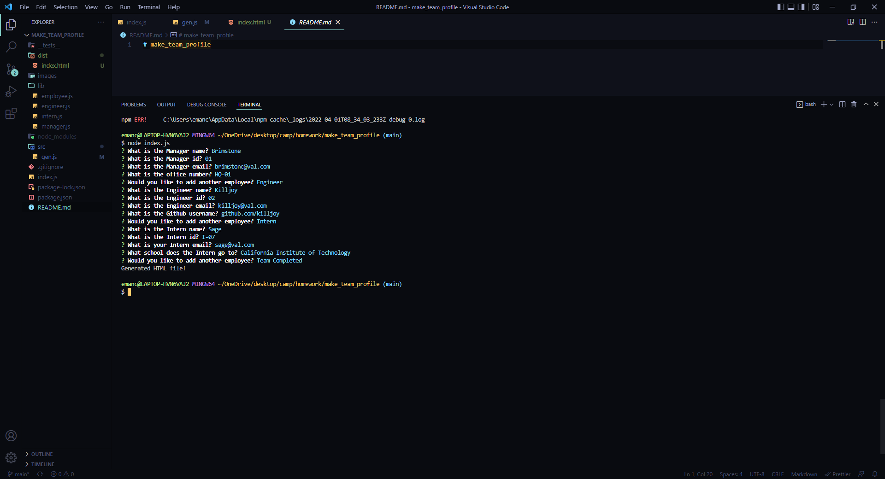
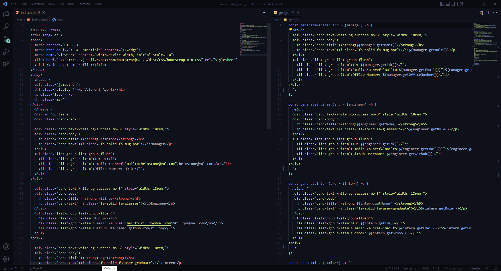
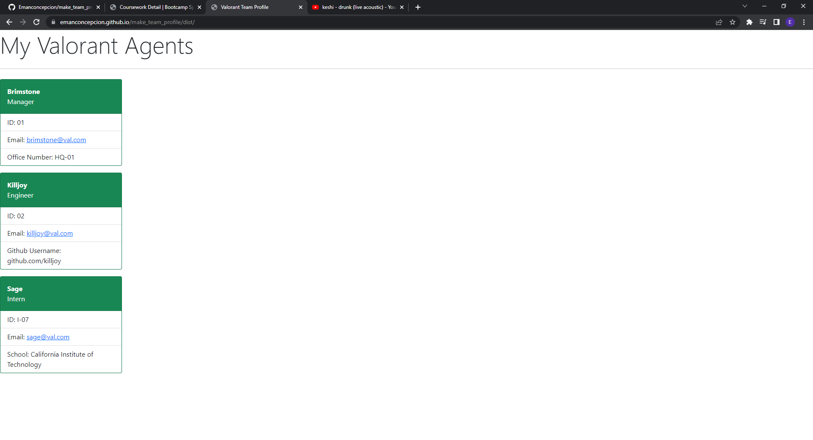

# Make Team Profile

## Overview

A backend focus coding that will automatically fill in information about the team members profile card.

## Products and Services

By answering couple of simple questions you will be able to generate a card with informations about your team member. The application can create three different profiles with the titles Engineer, Intern and last manager. Each card consist of Name, ID, Email, and GitHub UserName.

## User Story

- Type of User: Anybody that quickly needs to collect and display information of their team members.
- Goal: To make organization much easier and can be easily accesible.
- Benefit: The convenience of having a organized information

# Resources

- https://github.com/Emanconcepcion/make_team_profile
- https://emanconcepcion.github.io/make_team_profile/dist/
- https://drive.google.com/file/d/1Hdlip7lbOFTvgID09kH6yqBWkAsGV6cL/view

# Screenshots

